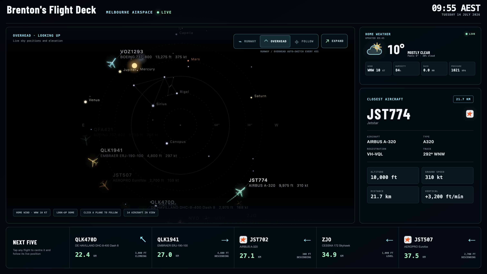
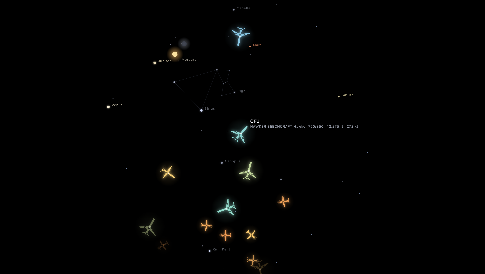
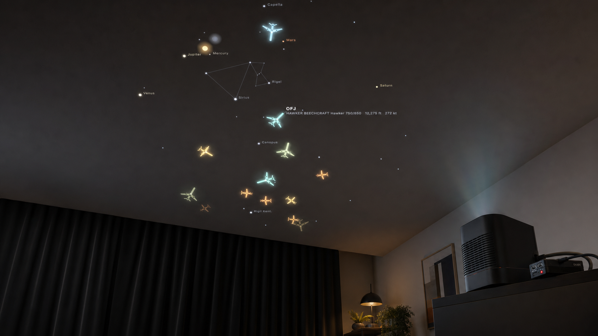

# Melbourne Flight Deck

## aka Brenton's Flight Deck

 

Melbourne Flight Deck is a live Melbourne airspace and night-sky display made for
an existing TV or touchscreen, an inexpensive ceiling projector, or a brighter
Raspberry Pi-powered premium installation. Its viewpoint is positioned over
Brenton's town in Victoria, not directly over Melbourne Airport (Tullamarine),
and combines real-time aircraft around that viewpoint with airport context,
current weather, local time, and the sky overhead.

Customising it for another town and name requires a new fork with its viewpoint
changed (and the name changed on the TV version). This is an Australia-focused
fork of
[cpaczek/skylight](https://github.com/cpaczek/skylight).

### Cost at a glance

| **TV dashboard** | **Overhead projector** | **Premium projector** |
|:---:|:---:|:---:|
| **Free** | **~A$150** | **A$1.8k–A$2k + curtains** |

 

## Live data

| Information | Source |
|---|---|
| Aircraft positions |  [airplanes.live](https://airplanes.live/) public ADS-B feed |
| Current conditions |  [Open-Meteo](https://open-meteo.com/) |
| Airline SVG catalog |  [Soaring Symbols](https://github.com/soaring-symbols/soaring-symbols) |
| Satellite elements |  [CelesTrak](https://celestrak.org/) |
| Sun, moon, stars and planets |  [astronomy-engine](https://github.com/cosinekitty/astronomy) |
| Satellite positions |  [satellite.js](https://github.com/shashwatak/satellite-js) |
| Melbourne Airport runways |  [OurAirports](https://ourairports.com/) |

 

## Display options

### Option 1 — TV dashboard (Free)

Use the full 16:9 dashboard on a regular TV using a screen and internet
connection you already have. Open it in either of these ways:

- **TV browser:** open the [public Kiosk 1 dashboard](https://skylight-melbourne.vercel.app/?kiosk=1)
  directly in the TV's built-in browser.
- **Screen mirroring:** open the same Kiosk 1 link on a phone, tablet, or computer,
  then mirror or cast that screen to the TV with AirPlay, Google Cast, Miracast,
  or a wired HDMI connection where supported.

Features include a live 70 km runway radar, overhead sky, tap-to-follow aircraft,
current weather, airline logos, and the next five flights. Aircraft positions
refresh about every three seconds, while Runway and Overhead alternate every 45
seconds.

Tap **Expand** for fullscreen and a screen wake lock; Kiosk 1 keeps the
cursor visible and includes interactive **Runway**, **Overhead**, and **Follow**
controls.

 

### Option 2 — Overhead Projector (About A$150)

Open the [public Kiosk 2 projector](https://brentons-overhead.vercel.app) for the
separate ceiling presentation. It shows live aircraft with longer trails, stars,
constellations, the Moon, planets, satellites and basic details for the nearest
flight. There are no dashboard panels or visible cursor. It requests a screen
wake lock immediately and enters fullscreen on its first tap.

This is a hand-off version, but it could easily be adapted to include either some automatically rotating views,
or a tap selections, borrowing from Option 1.

#### Example vertical projector to purchase

[Kimwood vertical projector — A$145.99 on Amazon Australia](https://www.amazon.com.au/Kimwood-Projector-Bluetooth-Ultra-Projectors/dp/B0G1S78RNM).
This inexpensive rotating-projector style is suited to the ceiling setup;
availability and pricing can change.

 

### Option 3 — Overhead Projector Premium

For a brighter, more permanent ceiling installation, use a Raspberry Pi as the
dedicated player and a Full HD standard-throw projector. The Pi boots directly
into Kiosk 2, so the projector only needs to provide a reliable HDMI image.

#### Suggested equipment

| Part | Suggested choice | Estimated cost (AUD) |
|---|---|---:|
| Player | [Raspberry Pi 4 Model B, 4 GB](https://core-electronics.com.au/raspberry-pi-4-model-b-4gb.html) | $163 |
| Pi essentials | Official power supply, case, 32 GB microSD card and micro-HDMI cable | $50–$80 |
| Vertical projector | [ViewSonic LSD400HD](https://www.viewsonic.com/ap/products/projectors/LSD400HD?app=1) — Full HD laser, 4,000 ANSI lumens, 360-degree projection and 1.48–1.62 standard throw | [$1,499 sale](https://justprojectors.com.au/viewsoniclsd400hd.htm) |
| Blackout curtains | Room-darkening curtains or blinds for stronger daytime contrast | Varies by room |
| Installation | Secure 360-degree-compatible stand or mount and cabling | $100–$250 |
| **Estimated total** | Pi setup with the ViewSonic; excludes curtains, optional local receivers, installation labour and internet service | **$1,800–$2,000 + curtains** |

 

#### Optional local receivers

<table width="100%">
  <tr>
    <th width="50%">Local ADS-B</th>
    <th width="50%">Airband audio</th>
  </tr>
  <tr>
    <td width="50%" valign="top">
      
    </td>
    <td width="50%" valign="top">
      
    </td>
  </tr>
  <tr>
    <td width="50%" valign="top">
      <strong><a href="https://core-electronics.com.au/flightaware-pro-stick-plus-usb-sdr-ads-b-receiver.html">FlightAware Pro Stick Plus — A$98.75</a></strong> 
      Sends local 1090 MHz aircraft positions to the Pi. 
      Built-in RF amplifier and 1090 MHz filter. 
      Needs a <strong><a href="https://core-electronics.com.au/3dbi-ads-b-1090mhz-sma-antenna-w-magnetic-base-1.html">1090 MHz antenna — A$14.70</a></strong>.
    </td>
    <td width="50%" valign="top">
      <strong><a href="https://www.tecsunradios.com.au/store/product/xhdata-d-808-lw-mw-sw-fm-airband-receiver/">XHData D-808 Airband Radio — A$185</a></strong> 
      Plays local 118–137 MHz VHF airband audio. 
      Built-in squelch quiets noise between calls. 
      Runs separately while FlightAware handles ADS-B.
    </td>
  </tr>
</table>

Both are optional, receive-only additions, and the public live feeds continue to
work without them: the FlightAware receiver supplies local aircraft data, while
the D-808 supplies radio audio. [ACMA says](https://www.acma.gov.au/apparatus-licences)
a receiver only needs an apparatus licence when an assigned frequency is required.

 

## License and attribution

The original Skylight project is by [Chris Paczek](https://github.com/cpaczek). 
This fork retains the upstream [MIT license](LICENSE). 
Airline SVGs are from [Soaring Symbols](https://github.com/soaring-symbols/soaring-symbols) by Anh Thang (MIT); airline trademarks remain with their owners.
